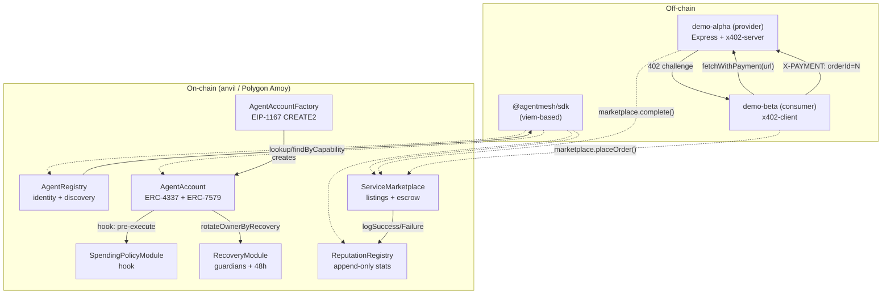

# AgentMesh Architecture



## Components

### Identity (Layer 1) — `AgentRegistry`

- `register(name, metadataURI, capabilities)` — caller (typically a smart
  account) commits a unique name and a list of capability hashes.
- `findByCapability(bytes32)` — discovery primitive. Capability hashes are
  derived as `keccak256(string)` off-chain.
- Storage: `agents`, `nameToAddress`, `capabilityToAgents`.

### Wallet (Layer 2) — `AgentAccount` + `AgentAccountFactory`

- ERC-4337 v0.7 surface: `validateUserOp(...)` validates an owner-ECDSA
  signature over the userOpHash.
- ERC-7579 minimal modules: `installModule(type, addr, initData)` plus a
  hook list executed before each `execute`.
- The factory uses `Clones.cloneDeterministic` so addresses are predictable
  given `(implementation, owner, salt)`.
- Two execution paths share the same `execute`:
  - Local/MVP: owner EOA signs and calls `account.execute(target, value, data)`.
  - Production: bundler submits a UserOp to `EntryPoint`, EntryPoint calls
    `validateUserOp` then `execute`.

### Modules (also Layer 2)

- **`SpendingPolicyModule`** (hook): per-account daily + per-tx limits with a
  rolling 24-hour window, plus a per-account target blacklist. Setting the
  policy is `setPolicy(daily, perTx)` from the account itself (so msg.sender
  inside the module IS the account).
- **`RecoveryModule`**: M-of-N guardians with a 48-hour timelock and an
  owner-controlled cancel. Calls back into the account through
  `rotateOwnerByRecovery(newOwner)`, gated by an explicit
  `recoveryModule` field on the account.

### Discovery (Layer 4) — `AgentRegistry.findByCapability`

Combined with Identity in MVP. A capability index is maintained on every
register/update; lookups are O(N agents with that capability).

### Marketplace (Layer 5) — `ServiceMarketplace`

- `createListing(serviceURI, priceWei)` → unique listingId.
- `placeOrder(listingId)` payable → escrows native ETH, returns orderId.
- `completeOrder(orderId, proof)` (provider only) → releases escrow,
  logs reputation success on both sides.
- `refundOrder(orderId)` (consumer only after `ORDER_TIMEOUT = 1h`) →
  returns escrow, logs reputation failure on provider.

### Reputation (Layer 6) — `ReputationRegistry`

- Append-only on-chain log of (success, failure, volume,
  unique-counterparties).
- Only authorized loggers may write — initially just `ServiceMarketplace`.
- Score formula: `score = clamp((successRate * sqrt(min(N,100))) / 10, 0,
  10000)`.

## End-to-end flow (the demo)

```mermaid
sequenceDiagram
    autonumber
    participant Owner_A as Alpha owner EOA
    participant A as AgentAccount(α)
    participant REG as AgentRegistry
    participant MKT as ServiceMarketplace
    participant REP as ReputationRegistry
    participant Owner_B as Beta owner EOA
    participant B as AgentAccount(β)
    participant Server as Express + x402-server

    Owner_A->>A: factory.createAccount + initialize
    Owner_A->>A: execute(REG.register("alpha"))
    Owner_A->>A: execute(MKT.createListing) ⟶ listingId=1
    Owner_A-->>Server: start; bind /weather/:city to listingId=1

    Owner_B->>B: factory.createAccount + initialize
    Owner_B->>B: execute(REG.register("beta"))
    B->>REG: findByCapability(data.weather) ⟶ [α]
    B->>MKT: getActiveListingsByProvider(α) ⟶ [1]

    B->>Server: GET /weather/Berlin (no X-PAYMENT)
    Server-->>B: 402 + accepts
    B->>MKT: execute(placeOrder(1)) {value:priceWei} ⟶ orderId=1
    B->>Server: GET /weather/Berlin (X-PAYMENT: orderId=1)
    Server->>MKT: getOrder(1) → status=Created, provider=α
    Server->>MKT: completeOrder(1, proof)  (auto-complete)
    MKT->>REP: logSuccess(α, β); logSuccess(β, α)
    Server-->>B: 200 {city:"Berlin", tempC:22}
    B->>REP: getReputation(α), getReputation(β)
```

## Why this shape

- **Smart account is the agent.** Every layer sees the *account* address as
  the agent identity. Owner EOAs are interchangeable signers (recoverable);
  the on-chain identity is the account.
- **Escrow + x402 hybrid.** x402 alone gives a payment proof; marketplace
  alone gives escrow. Combining them means both sides see deterministic
  outcomes: provider gets paid only on delivery, consumer can refund on
  no-show.
- **Reputation is a side-effect, not a service.** The marketplace logs to
  the registry on completion. Apps don't have to "rate" — every successful
  trade naturally builds the score.
